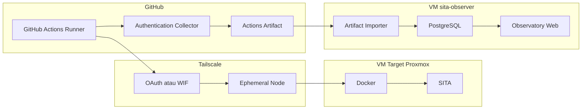
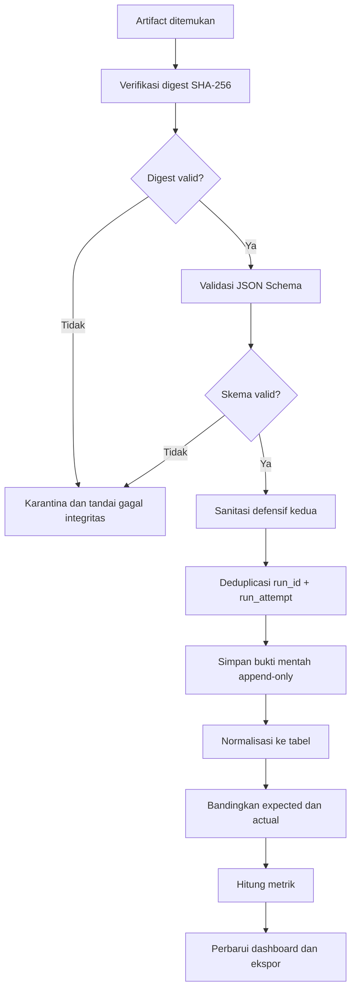

# Implementation Plan — SITA Workload Identity Observatory

## 1. Status Dokumen

| Atribut | Nilai |
|---|---|
| Status | Disetujui untuk menjadi dasar implementasi |
| Versi | 1.0.0 |
| Tanggal | 16 September 2026 |
| Pemilik | Muhamad Sari Rizki |
| Repositori objek penelitian | `msaririzki/sita` |
| Repositori instrumen penelitian | `msaririzki/sita-auth-observatory` |

Dokumen ini adalah sumber kebenaran awal untuk ruang lingkup, arsitektur,
teknologi, data, metrik, keamanan, dan urutan implementasi. Perubahan yang
mengubah variabel penelitian atau format bukti harus disertai keputusan
arsitektur baru dan kenaikan versi skema.

## 2. Tujuan

Membangun instrumen penelitian independen yang dapat:

1. merekam proses autentikasi deployment tanpa menyimpan credential mentah;
2. membandingkan OAuth statis, WIF dasar, dan WIF multi-klaim;
3. memvalidasi token OIDC secara independen melalui discovery dan JWKS;
4. menghubungkan identitas GitHub Actions, keputusan autentikasi, koneksi
   Tailscale, dan hasil deployment dalam satu jejak audit;
5. menghitung metrik penelitian secara konsisten dan dapat direproduksi;
6. menampilkan hasil melalui antarmuka yang mudah dipahami; dan
7. mengekspor bukti dalam JSON, CSV, dan laporan siap cetak.

## 3. Batas Ruang Lingkup

### Termasuk

- Collector yang berjalan pada GitHub Actions Runner.
- Skema bukti berversi.
- Sanitasi dan validasi data.
- Penyimpanan bukti sebagai GitHub Actions Artifact.
- Importer artefak ke database Observatory.
- Dashboard eksperimen dan perbandingan.
- OAuth statis, WIF dasar, dan WIF multi-klaim.
- Pengukuran autentikasi, koneksi Tailscale, akses VM, deployment, dan
  pembersihan sesi.
- Verifikasi integritas artefak menggunakan digest SHA-256.

### Tidak Termasuk

- Pemindaian keamanan aplikasi SITA secara luas.
- Security Gate dan Integration Gate aplikasi.
- Rollback aplikasi dan database.
- Perubahan fitur bisnis SITA.
- Penggantian GitHub atau Tailscale dengan penyedia identitas buatan sendiri.
- Klaim mengenai algoritma internal layanan GitHub atau Tailscale yang tidak
  dapat diamati.

Observatory adalah instrumen pengamatan. Observatory tidak boleh menentukan
keputusan autentikasi yang sedang diuji dan tidak boleh menjadi bagian wajib
dari jalur deployment.

## 4. Pertanyaan yang Harus Dijawab Sistem

Untuk setiap eksekusi, sistem harus dapat menjawab:

1. Siapa atau workload apa yang meminta akses?
2. Dari repositori, commit, branch, dan workflow mana permintaan berasal?
3. Mekanisme autentikasi apa yang digunakan?
4. Klaim apa yang diperiksa dan aturan apa yang diterapkan?
5. Mengapa permintaan diterima atau ditolak?
6. Berapa lama setiap tahap autentikasi berlangsung?
7. Apakah runner berhasil bergabung ke tailnet?
8. Apakah runner hanya dapat mencapai VM dan port yang diizinkan?
9. Apakah commit yang benar berhasil di-deploy?
10. Apakah akses sementara benar-benar berakhir setelah pekerjaan selesai?
11. Apakah bukti lengkap dan masih memiliki integritas yang valid?

## 5. Arsitektur Logis



### Penempatan

| Komponen | Lokasi | Alasan |
|---|---|---|
| Collector | GitHub-hosted runner | Mengamati konteks asli workflow |
| Bukti primer | GitHub Actions Artifact | Tetap tersedia walaupun autentikasi atau deployment gagal |
| Target SITA | VM Docker privat Proxmox | Objek pembuktian akses dan deployment |
| Observatory | VM `sita-observer` terpisah | Instrumen tidak ikut gagal bersama target |
| Database | PostgreSQL pada stack Observatory | Mendukung relasi, JSONB, dan agregasi data |
| Akses dashboard | Tailscale/LAN | Membatasi paparan data penelitian |

## 6. Keputusan Teknologi

### Aplikasi Web

| Lapisan | Teknologi | Keputusan |
|---|---|---|
| Backend | Laravel 13, PHP 8.5 | Modular monolith; validasi, queue, scheduler, dan pengujian matang |
| Frontend | Inertia 2, React 19, TypeScript | UI interaktif tanpa API terpisah yang tidak diperlukan |
| Styling | Tailwind CSS 4 | Design token, responsive layout, dan konsistensi visual |
| Komponen | Radix UI primitives + komponen lokal | Aksesibilitas dan kontrol penuh atas tampilan |
| Ikon | Lucide | Ikon konsisten dan ringan |
| Grafik | Recharts | Grafik React yang cukup untuk analisis eksperimen |
| Tabel | TanStack Table | Sort, filter, pagination, dan kolom data penelitian |
| Database | PostgreSQL 18 | Relasional, JSONB, constraint, dan agregasi |
| Queue | Laravel database queue | Cukup untuk skala penelitian tanpa Redis wajib |
| Deployment | Docker Compose | Reproduksibel pada VM Proxmox |

Laravel dipilih karena tim telah menggunakan Laravel dan React pada SITA.
Observatory tetap menjadi proyek mandiri, tetapi beban belajar dan risiko
implementasi lebih rendah daripada memperkenalkan stack yang seluruhnya baru.

### Collector

| Kebutuhan | Teknologi |
|---|---|
| Bahasa | TypeScript strict |
| Runtime | Node.js LTS yang didukung GitHub Actions |
| GitHub Action API | `@actions/core` |
| JWT/JWKS | `jose` |
| Validasi skema | AJV + JSON Schema |
| Pengujian | Vitest |
| Distribusi | JavaScript action yang dikompilasi dan dipin ke commit SHA |

Collector hanya menyimpan allowlist klaim. Token OIDC mentah tetap berada di
memori selama pemeriksaan dan tidak ditulis ke log, file, output, atau database.

### Importer

Importer mendukung dua jalur:

1. unggah artefak secara manual untuk proses yang sepenuhnya dapat diaudit; dan
2. sinkronisasi otomatis menggunakan GitHub App dengan izin read-only terhadap
   Actions dan metadata repositori.

Credential GitHub App berada pada VM Observer, bukan pada workflow deployment,
dan tidak dihitung sebagai credential pada perlakuan eksperimen. Jalur manual
tetap tersedia jika sinkronisasi otomatis gagal.

## 7. Konfigurasi Eksperimen

### A. OAuth Statis

- OAuth Client ID dan Client Secret digunakan oleh GitHub Actions.
- Tidak terdapat token OIDC untuk autentikasi Tailscale.
- Long-lived confidential secret pada jalur deployment: 1.

### B. WIF Dasar

- GitHub Actions meminta token OIDC.
- Tailscale memeriksa signature, issuer, audience, expiry, dan subject.
- Subject mengidentifikasi repositori SITA dengan cakupan dasar.
- Long-lived confidential secret pada jalur deployment: 0.

### C. WIF Multi-Klaim

- Seluruh pemeriksaan WIF dasar tetap berlaku.
- Aturan tambahan menggunakan claim stabil dan konteks workflow, minimal:
  `repository_id`, `repository_owner_id`, `ref`, dan `job_workflow_ref`.
- `event_name` atau `environment` ditambahkan bila format workflow final telah
  ditetapkan.
- Long-lived confidential secret pada jalur deployment: 0.

Ketiga konfigurasi menggunakan commit, target VM, port, image, dan prosedur
deployment yang sama. Perbedaan yang disengaja hanya mekanisme autentikasi dan
kebijakan klaim.

## 8. Model Bukti

Setiap run menghasilkan direktori berikut:

```text
evidence/
├── manifest.json
├── run-metadata.json
├── authentication-events.jsonl
├── oidc-claims-sanitized.json
├── claim-validation.json
├── tailscale-observation.json
├── deployment-result.json
├── cleanup-result.json
└── manifest.sha256
```

### Identitas dan Korelasi

| Field | Fungsi |
|---|---|
| `schema_version` | Menentukan kontrak bukti |
| `experiment_id` | Menghubungkan seluruh pengulangan satu eksperimen |
| `run_id` | GitHub Actions run ID |
| `run_attempt` | Membedakan pengulangan ulang run yang sama |
| `correlation_id` | UUID unik lintas event |
| `configuration` | `oauth_static`, `wif_basic`, atau `wif_multiclaim` |
| `scenario` | Skenario gangguan terkontrol |
| `repetition` | Nomor pengulangan |
| `expected_decision` | `allow` atau `deny` |

### Metadata GitHub

- repository dan repository ID;
- repository owner ID;
- commit SHA;
- ref dan ref type;
- workflow ref dan job workflow ref;
- event name;
- actor ID;
- run ID dan run attempt;
- runner OS, architecture, dan image version;
- waktu mulai dan selesai dalam UTC.

### Metadata OIDC yang Diizinkan

- JWT header: `alg`, `kid`, dan `typ`;
- standard claim: `iss`, `aud`, `sub`, `iat`, `nbf`, dan `exp`;
- GitHub claim: `repository`, `repository_id`, `repository_owner_id`, `ref`,
  `ref_type`, `sha`, `workflow_ref`, `job_workflow_ref`, `event_name`,
  `environment`, `run_id`, dan `run_attempt`;
- `jti` hanya disimpan dalam bentuk hash bila diperlukan untuk korelasi.

### Data yang Dilarang Disimpan

- JWT mentah;
- Authorization header;
- GitHub request token;
- Tailscale OAuth Client Secret;
- Tailscale access token;
- SSH private key;
- isi `.env`;
- password dan data pengguna SITA.

## 9. Proses Data



Prinsip pemrosesan:

- waktu disimpan dalam UTC dan ditampilkan sesuai zona pengguna;
- durasi internal memakai monotonic clock bila tersedia;
- bukti mentah tidak diubah setelah impor;
- proses impor bersifat idempotent;
- setiap perubahan normalisasi dapat dihitung ulang dari bukti mentah;
- policy dan schema version selalu direkam;
- data invalid tidak dibuang, tetapi dikarantina dengan alasan.

## 10. Model Data

| Tabel | Isi utama |
|---|---|
| `experiment_definitions` | Nama, tujuan, konfigurasi, dan jumlah pengulangan |
| `experiment_scenarios` | Input gangguan dan expected decision |
| `experiment_runs` | Satu eksekusi GitHub Actions |
| `authentication_events` | Event dan durasi setiap tahap |
| `claim_checks` | Expected, actual, result, dan reason code |
| `network_observations` | Node, IP, tag, jalur, target, dan reachability |
| `deployment_results` | Commit, image digest, container, dan health result |
| `cleanup_checks` | Waktu logout, penghapusan node, dan residual access |
| `evidence_artifacts` | Artifact ID, URL, digest, ukuran, dan expiry |
| `policy_versions` | Definisi aturan yang digunakan setiap run |
| `import_batches` | Status dan audit proses impor |

Constraint utama:

- unik `run_id, run_attempt`;
- semua event terhubung ke satu run;
- expected decision wajib tersedia sebelum run dinilai;
- evidence digest tidak dapat diubah setelah dinyatakan valid;
- policy version wajib ada pada konfigurasi WIF.

## 11. Algoritma Keputusan Analisis

Keputusan aktual:

```text
ALLOW = authentication accepted
        AND node joined
        AND authorized target reachable

DENY  = authentication rejected
        OR node failed to join
        OR authorized target unreachable because of policy
```

Klasifikasi:

```text
expected allow + actual allow = TP
expected deny  + actual deny  = TN
expected deny  + actual allow = FP
expected allow + actual deny  = FN
```

Reason code harus deterministik, misalnya:

```text
TOKEN_NOT_ISSUED
SIGNATURE_INVALID
ISSUER_MISMATCH
AUDIENCE_MISMATCH
TOKEN_EXPIRED
SUBJECT_MISMATCH
REPOSITORY_ID_MISMATCH
OWNER_ID_MISMATCH
REF_MISMATCH
WORKFLOW_MISMATCH
WIF_EXCHANGE_REJECTED
NODE_JOIN_TIMEOUT
TARGET_POLICY_DENIED
DEPLOYMENT_FAILED
CLEANUP_TIMEOUT
EVIDENCE_INTEGRITY_FAILED
```

## 12. Metrik Penelitian

### Metrik Keputusan

```text
Accuracy = (TP + TN) / (TP + TN + FP + FN)
FAR      = FP / (FP + TN)
FRR      = FN / (FN + TP)
```

Dashboard menampilkan nilai absolut dan persentase. Jika penyebut nol, nilai
ditampilkan sebagai tidak tersedia dan tidak dipaksakan menjadi nol.

### Metrik Waktu

- OIDC issuance latency;
- local JWT verification latency;
- claim evaluation latency;
- WIF exchange latency;
- tailnet join latency;
- target reachability latency;
- deployment duration;
- cleanup latency; dan
- total authentication latency.

Setiap kelompok menampilkan jumlah sampel, mean, median, minimum, maksimum,
standard deviation, dan P95. Jalur direct/DERP dan runner image dicatat sebagai
variabel pengganggu.

### Metrik Paparan dan Operasional

- jumlah long-lived confidential secret pada jalur deployment;
- jumlah nilai konfigurasi non-secret;
- langkah manual initial setup;
- langkah manual rotation/revocation;
- valid authentication success rate;
- deployment success rate pada skenario allow;
- cleanup success rate;
- residual access duration; dan
- trace completeness.

```text
Trace completeness = captured required events / all required events
```

## 13. Skenario Eksperimen

| Kode | Skenario | Expected |
|---|---|---|
| S01 | Repositori, branch, workflow, dan audience sah | Allow |
| S02 | Branch tidak diizinkan | Deny |
| S03 | Workflow berbeda dalam repositori yang sama | Deny |
| S04 | Repositori berbeda | Deny |
| S05 | Audience salah | Deny |
| S06 | Token dimodifikasi pada laboratorium | Deny |
| S07 | Token kedaluwarsa | Deny |
| S08 | Tag Tailscale tidak diizinkan | Deny |
| S09 | Target VM atau port tidak diizinkan | Deny |
| S10 | Pekerjaan selesai dan akses diperiksa ulang | Deny setelah selesai |

Tidak semua skenario berlaku pada OAuth. Dashboard harus menampilkan `N/A`,
bukan menganggapnya lulus atau gagal. Skenario final dijalankan minimal lima
kali; sepuluh pengulangan direkomendasikan bila waktu dan kuota memungkinkan.

## 14. Integritas Penelitian

- Skenario dan expected decision ditetapkan sebelum eksekusi.
- Satu commit SITA digunakan untuk perbandingan satu batch.
- Ketiga konfigurasi menggunakan VM dan target port yang sama.
- Urutan konfigurasi diselang-seling untuk mengurangi bias waktu jaringan.
- Semua kegagalan, termasuk kegagalan Collector, tetap dicatat.
- Run yang dikeluarkan dari analisis harus memiliki alasan tertulis.
- Data contoh/sintetis diberi label dan tidak dicampur dengan hasil eksperimen.
- Screenshot dashboard bukan sumber data primer; JSON artifact dan digest adalah
  sumber bukti primer.

## 15. Keamanan Observatory

- Dashboard hanya dapat diakses melalui Tailscale atau jaringan laboratorium.
- Autentikasi pengguna menerapkan peran `administrator`, `researcher`, dan
  `viewer`.
- GitHub App hanya memiliki izin read-only terhadap Actions dan metadata.
- Import tidak pernah mengeksekusi isi artefak.
- JSON memiliki batas ukuran, nesting, dan tipe data.
- Output teks ditampilkan sebagai teks, bukan HTML mentah.
- Log aplikasi tidak mencetak request body yang berisi bukti.
- Backup database dienkripsi dan memiliki retensi yang ditetapkan.
- Data yang ditampilkan pada skripsi dianonimkan bila memuat ID pengguna.

## 16. Strategi Pengujian

| Jenis | Fokus |
|---|---|
| Unit | Formula metrik, klasifikasi TP/TN/FP/FN, reason code |
| Contract | Collector output sesuai JSON Schema |
| Security | Token/secret tidak pernah tersimpan atau tercetak |
| Integration | Artifact → importer → database → dashboard |
| Fixture | Bukti sintetik untuk semua status dan edge case |
| Browser | Filter, tabel, detail run, ekspor, akses keyboard |
| Resilience | Artifact rusak, duplikat, terlambat, dan versi tidak dikenal |

Pengujian formula memakai dataset kecil dengan hasil manual yang telah
diketahui. Pengujian browser memakai selector berdasarkan role, label, dan teks
yang stabil.

## 17. Deployment Observatory

VM `sita-observer` menjalankan Docker Compose:

```text
reverse-proxy
observatory-web
observatory-worker
observatory-scheduler
postgres
```

Redis tidak menjadi kebutuhan awal. Queue database cukup untuk sinkronisasi
artefak penelitian. Redis hanya ditambahkan jika pengukuran menunjukkan
kebutuhan nyata, bukan untuk memperbanyak teknologi.

## 18. Tahapan Implementasi

### Fase 0 — Fondasi

- Finalisasi plan, data dictionary, dan vocabulary reason code.
- Buat repository rules dan branch protection.
- Buat ADR untuk keputusan besar.

### Fase 1 — Schema dan Fixture

- Buat JSON Schema v1.
- Buat bukti sintetik allow, deny, failure, dan partial trace.
- Buat validator dan redaction tests.

### Fase 2 — Collector

- Rekam metadata GitHub.
- Minta dan verifikasi token OIDC.
- Rekam Tailscale dan deployment event.
- Finalisasi evidence dan SHA-256 manifest.
- Upload artifact dengan `if: always()`.

### Fase 3 — Backend dan Importer

- Scaffold Laravel dan PostgreSQL.
- Implementasi model dan migration.
- Implementasi unggah manual.
- Implementasi verifikasi digest, schema, sanitasi, dan deduplikasi.
- Tambahkan GitHub App pull setelah jalur manual stabil.

### Fase 4 — Dashboard

- Overview.
- Experiment matrix.
- Run detail dan timeline.
- Claim/policy comparison.
- Configuration comparison.
- Evidence integrity dan export.

### Fase 5 — Integrasi SITA

- Tambahkan pilihan auth mode dan scenario pada workflow penelitian.
- Migrasikan WIF dasar.
- Tambahkan WIF multi-klaim.
- Pertahankan OAuth statis khusus laboratorium sebagai baseline.

### Fase 6 — Pilot

- Jalankan semua skenario satu kali.
- Evaluasi kelengkapan event dan bias instrumen.
- Bekukan Collector, schema, policy, dan versi dashboard untuk eksperimen final.

### Fase 7 — Eksperimen Final

- Jalankan minimal lima pengulangan per skenario yang relevan.
- Audit data yang dikeluarkan.
- Ekspor dataset, grafik, dan tabel.
- Dokumentasikan keterbatasan dan hasil.

## 19. Definition of Done

Sistem dinyatakan siap untuk eksperimen final jika:

- tiga konfigurasi autentikasi dapat dijalankan dengan commit SITA yang sama;
- token dan secret mentah tidak ditemukan pada log, artifact, atau database;
- seluruh fixture lolos validasi schema;
- digest artifact diverifikasi sebelum impor;
- proses impor idempotent;
- perhitungan metrik telah diuji dengan hasil manual;
- dashboard menampilkan expected dan actual secara terpisah;
- `N/A` tidak dihitung sebagai gagal;
- semua waktu menggunakan UTC pada penyimpanan;
- filter dashboard tercermin pada URL;
- tabel dan grafik dapat diekspor;
- alur utama dapat digunakan dengan keyboard;
- VM target dapat gagal tanpa menghilangkan bukti pada GitHub; dan
- versi Collector, schema, policy, SITA commit, dan dashboard tercatat.

## 20. Referensi Teknis Utama

- OpenID Connect Core: <https://openid.net/specs/openid-connect-core-1_0-18.html>
- GitHub Actions OIDC: <https://docs.github.com/en/actions/reference/security/oidc>
- GitHub Actions Artifact: <https://docs.github.com/en/actions/tutorials/store-and-share-data>
- Tailscale WIF: <https://tailscale.com/docs/features/workload-identity-federation>
- Tailscale GitHub Action: <https://tailscale.com/docs/integrations/github/github-action>
- Laravel: <https://laravel.com/docs>
- Inertia: <https://inertiajs.com/>
- React: <https://react.dev/>
- Tailwind CSS: <https://tailwindcss.com/>
- PostgreSQL: <https://www.postgresql.org/docs/>
